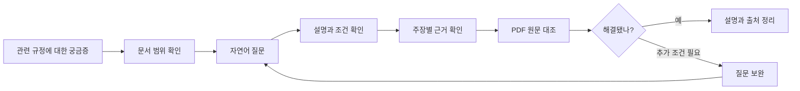
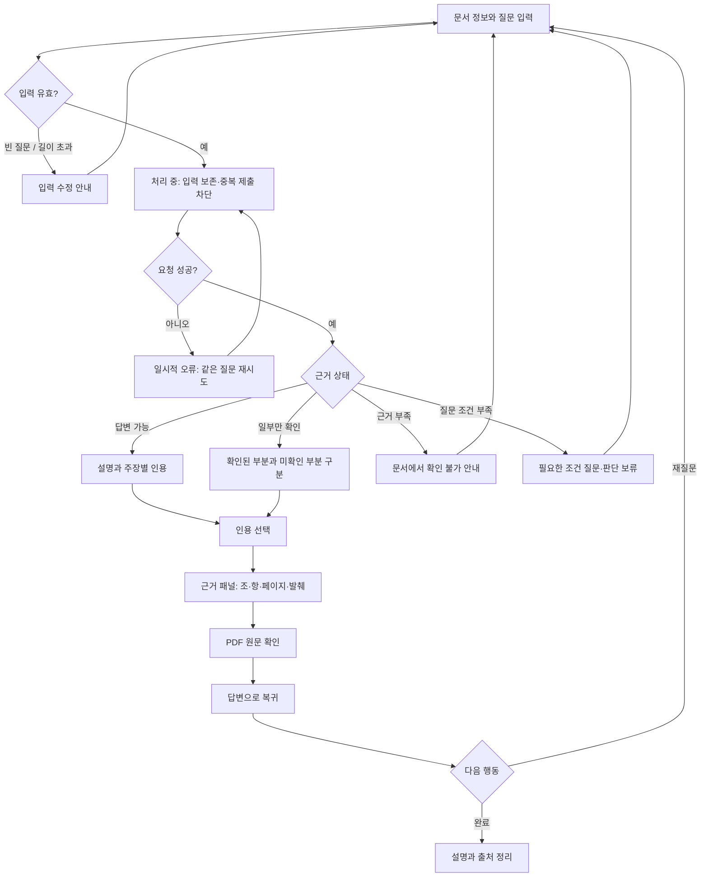
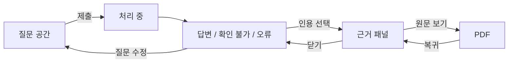
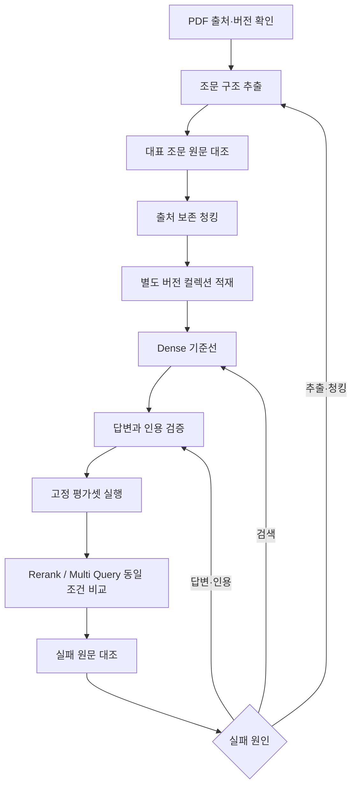

# AI 기본법 근거 기반 QA — 사용자 저니와 구현 계획

기획 초안 · 2026-10-08. 제안 사항은 구현 완료나 범위 확정을 뜻하지 않는다.

## 1. 만들려는 제품

**AI 기본법 문서에 관한 질문에 근거를 붙여 설명하고, 사용자가 조문·항·페이지를 직접 확인할 수 있는 도구**를 제안한다.

사용자는 답변을 읽는 데서 끝나지 않는다. 관련 조문을 찾고 설명과 원문을 대조한 뒤, 문서로 확인 가능한 내용과 추가 확인이 필요한 내용을 구분한다. 회사의 법적 의무를 자동 확정하는 기능은 포함하지 않는다.

기존 자료는 주제와 기술 실험 방향을 담은 초안이다. 아래 사용자·화면은 이번 기획의 가설이며, 실제 법률 내용이나 적용 여부를 새로 판단하지 않는다. 예시 질문도 기능 설계용이다.

| 구분 | 상태 |
| --- | --- |
| 확인한 코드 | 설정·모델·Qdrant 공유 모듈, Notebook, Compose, 기본 FastAPI 앱과 GET `/` |
| 제품 완료 증거 없음 | 전체 PDF 적재, `/ask`, 인용 검증, 검색 비교 평가 |
| 기존 MVP 초안 | PDF 한 버전, 답변·출처 API, Dense/Rerank/Multi Query 비교 |
| 이번 사용자 가설 | AI 서비스를 기획·개발하거나 AI 기본법을 학습하는 사람 |
| 이번 확장 제안 | 질문 화면, 근거 패널, PDF 원문 확인, 현재 세션 질문 이력 |
| 미정 | 실제 사용자, PDF 원본·버전, 기간, 모델 기능, 화면 포함 여부 |

## 2. 사용자와 해결할 문제

우선 사용자 가설은 **AI 서비스 기획자·개발자**다. 법률 전문가는 아니지만 관련 규정과 원문을 확인하고 싶어 한다.

- 계기: 회의나 학습 중 용어·규정에 관한 질문이 생긴다.
- 불편: 긴 PDF에서 관련 조문을 찾고 정의·조건·예외를 함께 읽어야 한다.
- 원하는 결과: 질문에 관련된 설명과 원문 위치를 한 번에 확인한다.
- 제품 역할: 문서 탐색과 이해를 돕고, 문서 밖 판단은 확인 불가로 표시한다.

보조 사용자는 프로젝트 팀원이다. 동일 문서와 질문으로 검색 방식을 비교하고 실패 원인을 찾는다. 일반 사용자가 검색 모드·벡터 점수를 이해해야 하는 구조는 피한다.

## 3. 대표 사용자 저니

상황: “우리 서비스와 관련해 어떤 내용을 먼저 확인해야 할까?”라는 궁금증이 생긴다. 제품은 서비스의 법적 지위를 판정하기보다 문서에서 확인되는 관련 내용과 추가로 필요한 조건을 제시한다.

| 단계 | 사용자 행동 | 생각 / 불편 | 제품 대응 | 성공 조건 |
| --- | --- | --- | --- | --- |
| 진입 | 문서 정보와 예시 질문 확인 | 내 질문을 여기서 확인할 수 있나? | 문서명·버전·제공 범위 | 답변 대상을 이해 |
| 질문 | 자연어 질문 작성 | 법률 용어를 몰라도 되나? | 자유 입력과 원문 기반 예시 | 자기 표현으로 질문 가능 |
| 대기 | 요청 처리 확인 | 입력이 전달됐나? | 처리 중 상태·중복 제출 차단 | 대기와 실패가 구분됨 |
| 답변 | 요약·조건·예외 읽기 | 내 상황에 관련된 내용인가? | 짧은 설명과 주장별 인용 | 내용과 한계를 이해 |
| 근거 | 인용 번호 선택 | 실제 문서에 있는 설명인가? | 조·항·페이지·실제 발췌 | 주장과 근거를 대조 |
| 원문 | PDF 페이지 확인 | 앞뒤 문맥도 보고 싶다 | 동일 버전 PDF 연결 | 문맥 확인 후 복귀 |
| 재질문 | 상황·조건 추가 | 다른 경우에도 해당하나? | 입력 수정·이전 결과 보존 | 조건을 명시한 질문 가능 |
| 마무리 | 필요한 내용 정리 | 다시 찾을 수 있나? | 답변과 출처 함께 복사 제안 | 원문 위치까지 기록 |

## 4. User Flow — 정상과 예외

답변 결과 상태 제안:

- `answered`: 질문 전체를 근거로 설명 가능.
- `partial`: 일부만 확인 가능. 확인되지 않는 부분을 별도로 표시.
- `insufficient_evidence`: 문서에 충분한 근거가 없음.
- `needs_clarification`: 질문의 대상·조건이 부족함.

시스템 장애는 위 상태와 별개다. 유사 조문이 검색돼도 질문의 핵심 조건을 뒷받침하지 않으면 답변 가능으로 처리하지 않는다. 벡터 점수를 법률적 확실성이나 신뢰도 퍼센트로 보여주지 않는다.

## 5. 화면과 상태 설계 제안

웹 화면은 기존 MVP에서 제외돼 있다. 아래는 확장할 경우의 설계이며 API 버전은 같은 입력·출력으로 먼저 검증한다.

**A. 질문·답변 작업 공간**

- 상단: 문서명, 버전·기준일, 처리 범위. 등록된 버전을 최신 법령이라고 표현하지 않는다.
- 첫 진입: 질문 입력, 원문 대조로 작성한 예시 질문 3개.
- 처리 중: 입력 보존, 중복 제출 차단. 확인하지 않은 내부 처리 단계를 보여주지 않는다.
- 결과: 짧은 요약 → 상세 설명 → 조건·예외 → 근거 → 확인 한계.
- 주장 옆 `[1]`, `[2]`가 해당 근거를 연다. 근거 목록만 나열하지 않는다.
- 재질문은 초기에는 독립 질문이다. “그건?”처럼 앞선 대화를 전제로 한 질문은 조건을 다시 적도록 안내한다. 세션 이력이 있다고 대화 기억을 약속하지 않는다.

**B. 근거 패널**

- 선택 인용, 문서명·버전, 조·항·호, PDF 페이지, 실제 발췌문.
- 없는 조·항·호를 추정하지 않는다. 인쇄 페이지와 PDF 페이지가 다르면 구분한다.
- 넓은 화면은 옆 패널, 좁은 화면은 답변 아래 펼치는 영역.
- 패널을 닫으면 읽던 답변 위치를 유지한다.

**C. 원문 확인**

- 동일 버전의 PDF 또는 확인된 원본 링크를 연다.
- 페이지 이동이 지원되지 않으면 PDF 페이지 번호를 안내한다.
- 원본을 열 수 없으면 발췌와 출처는 유지하고 접근 불가를 표시한다.
- 법령 URL을 임의 생성하거나 다른 버전 문서로 연결하지 않는다.

첫 화면 필수는 질문·답변·인용·원문 연결이다. 답변과 출처 복사, 현재 세션 이력은 후속 편의 기능으로 둔다.

## 6. 상태별 사용자 대응

| 상태 | 안내 | 다음 행동 | 구현 규칙 |
| --- | --- | --- | --- |
| 빈 입력 | 질문을 입력해 주세요 | 수정 | 모델 호출 없음 |
| 처리 중 | 질문을 확인하고 있습니다 | 대기 | 중복 제출 차단 |
| 답변 가능 | 근거 기반 설명 | 인용 확인 | 주장별 근거 연결 |
| 일부 확인 | 확인된 내용과 미확인 내용 | 조건 보완 | 모르는 내용을 단정하지 않음 |
| 근거 부족 | 이 문서에서는 확인하기 어렵습니다 | 질문 구체화·범위 확인 | 억지 답변 없음 |
| 조건 부족 | 대상·상황을 추가로 알려 주세요 | 조건 보완 | 법적 지위 자동 판정 없음 |
| 시스템 실패 | 일시적으로 답변하지 못했습니다 | 같은 질문 재시도 | 입력 유지·비밀값 숨김 |
| 인용 검증 실패 | 근거 연결을 확인하지 못했습니다 | 재시도 | 정상 답변으로 노출하지 않음 |
| 원문 접근 불가 | 원문을 열 수 없습니다 | 발췌·페이지 확인 | 출처 정보 유지 |

## 7. 개발팀 흐름

적재는 개발팀 작업이다. 일반 사용자 PDF 업로드는 첫 버전에 넣지 않는다. 공유 컬렉션을 삭제·재생성하지 않고 별도 버전 컬렉션에서 검증한다.

## 8. MVP와 확장 구분

| 기능 | 기존 API·실험 MVP | 사용자 경험 확장 제안 |
| --- | --- | --- |
| 자료 | 지정 PDF 한 버전 | 동일 자료·범위 표시 |
| 질문 | `/ask`, Notebook/요청 도구 | 자연어 입력 화면 |
| 답변 | 상태·설명·실제 사용 출처 | 주장별 클릭 가능한 인용 |
| 근거 | 조·항·페이지·발췌 반환 | 근거 패널과 PDF 연결 |
| 검색 | Dense 먼저, 세 방식 비교 | 평가로 선정한 기본 방식 |
| 실패 | 입력·근거 부족·모델 실패 구분 | 안내·입력 유지·재시도 |
| 재질문 | 독립 요청 | 현재 세션 이력·입력 수정 |
| 검증 | 가능 8개 + 불가 2개부터 | 사용자가 근거를 찾는 과정 관찰 |

화면은 FastAPI가 제공하는 작은 HTML/CSS/JavaScript 화면부터 시작하는 방안을 제안한다. 화면 포함이 확정될 때 기술 선택도 확정한다. 기존 3~4시간 초안에 화면 완료까지 약속하지 않는다.

제외: 인증·결제, 사용자별 PDF 업로드, 여러 법령 통합, 최신 법령 자동 갱신, 법적 의무 자동 판정, 장기 대화 기억, 외부 웹 검색, 배포, BM25/Hybrid, 대규모 튜닝.

## 9. 데이터와 API 계약 제안

- 문서: `document_id`, `document_version`, `title`, `source_uri`, `pdf_sha256`, `processed_scope`. 일부 처리면 답변과 평가에 부분 문서임을 표시.
- 청크: `chunk_id`, 문서 ID·버전, 텍스트, 실제 조·항·호, PDF 시작·끝 페이지, 선택적 인쇄 페이지, 부모 조문 ID. 긴 조문을 나누더라도 조건·예외와 출처를 보존.
- 검색: `retrieve(question, mode, k) → SearchHit[]`. 청크·순위·내부 점수 반환. 후보 20/K=5는 기존 제안이며 확정값이 아님.
- 답변: `status`, `summary`, `claims[{text,citation_ids}]`, `limitations`, `clarification_question`, `citations[]`.
- 인용: 인용 ID, chunk_id, 문서 버전, 조·항·페이지, 실제 발췌, 원문 위치. 사용한 근거만 반환.

POST `/ask` 입력은 `question`과 선택적 `search_mode`. 일반 사용자 화면에는 검색 모드를 노출하지 않는다. 초기 질문 길이 상한은 2,000자로 제안하며 계약 단계에서 확정한다.

| 응답 | 의미 |
| --- | --- |
| 200 | 정상 처리. 답변·부분 확인·근거 부족·조건 부족은 `status`로 구별 |
| 422 | 빈 질문·공백·길이 초과·잘못된 모드 |
| 503 / 504 | 서비스 의존성 실패 / 시간 초과 |

인용 ID가 컨텍스트에 실제 존재하는지, 문서·페이지가 일치하는지, 발췌가 청크 원문에 있는지 검사한다. 이것만으로 주장의 의미가 근거에서 따라온다고 보장하지 않으므로 의미적 충실성은 원문 대조로 평가한다. 요청 ID로 실패를 추적하되 키·환경변수 값·전체 사용자 질문은 기본 로그에 남기지 않는다.

## 10. 구현 순서와 완료 조건

하네스 초안은 `phases/rag-mvp/`에 기록한다. 모두 pending이며 이번에는 제품 구현을 실행하지 않는다. 실행 전에 입력 문서와 모델·팀 계약을 확정한다. 아래 테스트 파일은 향후 구현 대상이고 현재 통과한 테스트가 아니다.

| 단계 | 제안 산출물 | 완료 조건 |
| --- | --- | --- |
| 0. 계약 | `common/contracts.py`, `tests/test_contracts.py` | 입력·상태·청크·인용 계약, fake fixture 검증 |
| 1. 추출·청킹 | `common/ingestion.py`, `scripts/ingest.py`, `tests/test_ingestion.py` | 조문·항·페이지 경계 보존, 안정 ID, 새 버전 적재 |
| 2. Dense | `common/retrieval.py`, `tests/test_retrieval.py` | 같은 임베딩 설정, 버전 격리, 중복·빈 결과 처리 |
| 3. 답변 | `common/answering.py`, `tests/test_answering.py` | 네 상태, 실제 사용 인용, 잘못된 인용 차단 |
| 4. API | `app/main.py`, `tests/test_api.py` | 정상·422·근거 부족·503/504, fake 검증 |
| 5. 평가 | `common/evaluation.py`, `scripts/evaluate.py`, `tests/test_evaluation.py` | 세 모드 고정 조건 비교·실패 보고 |
| 후속 화면 | 제안 `app/static/`, 브라우저 검증 | 질문→답변→근거→원문, 오류 재시도 |

순서: 계약 → 청킹 → Dense → 답변 → API → 평가. 화면은 범위 확정 후 별도 단계로 등록한다. 모델 연결이 막히면 fake로 로컬 계약과 예외를 검증하고 외부 통합 완료를 따로 판단한다.

동작 변경은 실패하는 회귀 테스트를 먼저 확인하고 구현한다. 모델·Qdrant는 단위 테스트에서 fake/mock. 실제 호출·적재·브라우저 검증은 별도로 기록한다. 제품 의존성 추가 시 uv.lock도 관리한다. 기존 설정·Notebook 변경은 보존한다.

## 11. 평가와 완료 판단

- 데이터: 정의, 조건·예외, 여러 항, 페이지를 가로지르는 조문을 원문과 대조. 샘플 검토를 전체 품질 보증으로 표현하지 않음.
- 검색: 정답 조·항 기준 Hit@K, Recall@K, MRR. 답변 불가 문항은 별도 평가. 문서·청킹·임베딩·K·평가셋 버전 고정.
- 답변: 필수 내용, 조건·예외, 근거 없는 주장, 실제 사용 인용, 확인 불가 처리를 사람이 검토. 인용 무결성과 의미 평가를 구분.
- 사용자 경험: 스스로 근거 조문·페이지를 찾는지, 실패 후 입력을 잃지 않는지, 근거 부족을 장애로 오해하지 않는지 관찰. 측정 전 만족도·시간 단축 수치를 만들지 않음.

완료 기준 제안: 고정 평가 문항 모두에 원문 대조 결과를 남긴다. 끊어진 인용·거짓 출처·답변 불가 문항의 단정적 답변은 0건이어야 한다. 소규모 평가 통과를 일반적인 법률 정확도 보증으로 표현하지 않는다. Rerank/Multi Query 개선은 결과로 판단한다.

## 12. 일정과 우선 결정 사항

기존 3~4시간은 팀 API·실험 세션 가정이다. PDF·모델이 준비되지 않으면 성립하지 않는다. 통합이 늦으면 Dense API와 출처 확인을 먼저 확보하고 추가 튜닝을 줄인다. 사용자 화면은 별도 시간을 확보해 산정한다.

다음 논의에서 먼저 정할 사항:

1. 완성물: API·Notebook 실험까지인지, 실제 질문 화면까지인지. 저니를 직접 보여주려면 작은 화면을 후속 범위에 넣는 것을 추천한다.
2. 사용자: 기획자·개발자 가설이 맞는지, 학습·발표용 비교 실험이 중심인지.
3. 시간과 자료: 작업 가능 시간, PDF 버전·범위, 팀원 역할.

기술 확인 항목: 채팅·임베딩·Rerank 각각의 제공 여부, 임베딩 차원, 별도 컬렉션 명칭, 원본 PDF 제공 방법. 변수 이름만으로 지원 기능을 추정하지 않는다. 자료 확정 전 법률 정답이나 실제 조문 예시를 작성하지 않는다.
